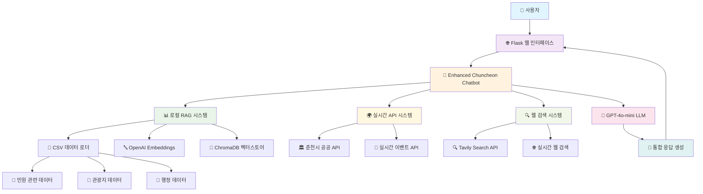
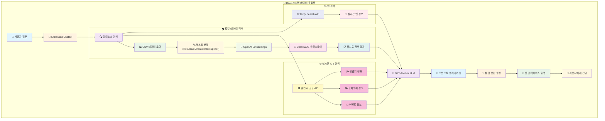
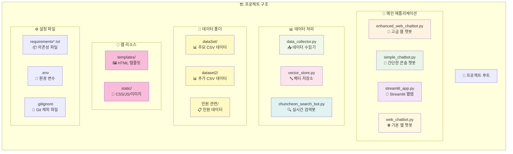

# 🌸 춘천시 AI 챗봇 시스템 (EROM)

> **2025년 프롬프톤 - 강원특별자치도 춘천시 RAG 기반 AI 도우미**

[](https://python.org)
[](https://flask.palletsprojects.com/)
[](https://langchain.com)
[](https://openai.com)
[](https://www.trychroma.com/)

## 👥 개발팀

**🏆 팀장:** 김재형 (한림대학교 20학번 콘텐츠IT학과)  
**👨‍💻 팀원:** 김성호 (한림대학교 22학번 콘텐츠IT학과)  
**📊 팀원:** 김강민 (한림대학교 21학번 빅데이터학과)  

---

## 📋 목차

- [프로젝트 개요](#-프로젝트-개요)
- [시스템 아키텍처](#-시스템-아키텍처)
- [주요 기능](#-주요-기능)
- [RAG 시스템 구현](#-rag-시스템-구현)
- [프로젝트 구조](#-프로젝트-구조)
- [설치 및 실행](#-설치-및-실행)
- [API 및 라이브러리](#-api-및-라이브러리)
- [데이터셋](#-데이터셋)
- [사용법](#-사용법)
- [기술적 특징](#-기술적-특징)

---

## 🎯 프로젝트 개요

**춘천시 AI 챗봇 시스템 (EROM)**은 강원특별자치도 춘천시 시민들을 위한 종합적인 정보 제공 AI 도우미입니다. RAG(Retrieval-Augmented Generation) 기술을 활용하여 춘천시의 행정, 관광, 문화, 교통 등 다양한 분야의 정보를 실시간으로 제공합니다.

### 🎭 AI 캐릭터 "춘이"
- **이름:** 춘이 🌸
- **역할:** 춘천시 전문 AI 도우미
- **특징:** 친근하고 정확한 정보 제공, 존댓말 사용, 춘천 특화 지식

---

## 🏗️ 시스템 아키텍처



---

## ✨ 주요 기능

### 🤖 **다중 소스 정보 통합**
- **로컬 RAG 시스템**: 춘천시 공식 데이터 기반 정확한 정보 제공
- **실시간 API 연동**: 춘천시 공공데이터 API를 통한 최신 이벤트/축제 정보
- **웹 검색 기능**: Tavily API를 통한 실시간 웹 정보 검색

### 💬 **대화형 인터페이스**
- **세션 기반 대화**: 사용자별 대화 기록 관리 및 컨텍스트 유지
- **다양한 인터페이스**: 웹, Streamlit, 콘솔 버전 제공
- **빠른 질문**: 자주 묻는 질문 버튼으로 편리한 접근

### 🎨 **현대적인 UI/UX**
- **반응형 웹 디자인**: 모바일/데스크톱 최적화
- **실시간 타이핑 효과**: 자연스러운 대화 경험
- **직관적인 인터페이스**: 사용자 친화적 디자인

---

## 🧠 RAG 시스템 구현

### 📊 **데이터 처리 파이프라인**



### 🔧 **RAG 핵심 구성요소**

1. **📊 데이터 수집 및 전처리**
   - `ChuncheonDataLoader`: CSV 파일 자동 로드 및 Document 변환
   - `RecursiveCharacterTextSplitter`: 텍스트 청킹 (chunk_size=1000, overlap=200)
   - 한글 인코딩 자동 처리 (UTF-8, CP949)

2. **🔤 임베딩 및 벡터화**
   - **OpenAI Embeddings**: 고성능 텍스트 임베딩
   - **ChromaDB**: 벡터 데이터베이스로 빠른 유사도 검색
   - **지속성**: `./chroma_db` 디렉토리에 벡터 데이터 저장

3. **🔍 검색 및 검색 전략**
   - **하이브리드 검색**: 로컬 + API + 웹 검색 결합
   - **컨텍스트 윈도우**: 최적화된 검색 결과 조합 (k=5)
   - **실시간 정보**: API 및 웹 검색으로 최신성 보장

---

## 📁 프로젝트 구조



### 📂 **주요 파일 설명**

#### 🐍 **메인 애플리케이션**
- **`enhanced_web_chatbot.py`** ⭐ **메인 시스템**
  - Flask 기반 고급 웹 챗봇
  - 멀티소스 RAG 시스템 (로컬 + API + 웹)
  - 세션 관리 및 대화 기록 유지
  - 실시간 춘천시 공공 API 연동

- **`simple_chatbot.py`**
  - 콘솔 기반 간단한 챗봇
  - FAISS 벡터스토어 사용
  - 한국어 임베딩 모델 활용

- **`streamlit_app.py`**
  - Streamlit 기반 웹 인터페이스
  - 사이드바 설정 및 데이터 관리 기능

- **`web_chatbot.py`**
  - 기본 Flask 웹 챗봇
  - Tavily 실시간 검색 전용

#### 📊 **데이터 처리 모듈**
- **`data_collector.py`**
  - 춘천시 공식 데이터 수집기
  - 구조화된 데이터 생성 및 관리

- **`vector_store.py`**
  - FAISS 기반 벡터스토어 관리
  - 한국어 임베딩 모델 (ko-sroberta-multitask)

- **`chuncheon_search_bot.py`**
  - Tavily API 전용 실시간 검색 챗봇

#### 🎨 **웹 리소스**
- **`templates/enhanced_index.html`**: 고급 웹 인터페이스 (메인)
- **`templates/index.html`**: 기본 웹 인터페이스
- **`static/`**: CSS, JavaScript, 이미지 리소스

---

## 🚀 설치 및 실행

### 📋 **사전 요구사항**
- Python 3.8 이상
- OpenAI API 키
- Tavily API 키 (선택사항)
- 춘천시 공공데이터 API 키

### 🔧 **1단계: 프로젝트 클론 및 환경 설정**

```bash
# 프로젝트 클론
git clone https://github.com/prompton-EROM/EROM_DEMO.git
cd EROM_DEMO

# 가상환경 생성 및 활성화
python -m venv .venv
source .venv/bin/activate  # Windows: .venv\Scripts\activate

# 의존성 설치 (고급 버전)
pip install -r requirements_enhanced.txt
```

### 🔑 **2단계: 환경 변수 설정**

`.env` 파일을 생성하고 다음 내용을 추가:

```env
# OpenAI API 키 (필수)
OPENAI_API_KEY=your_openai_api_key_here

# Tavily API 키 (웹 검색용, 선택사항)
TAVILY_API_KEY=your_tavily_api_key_here

# Flask 보안 키
FLASK_SECRET_KEY=your_secret_key_here
```

### ⚡ **3단계: 실행**

#### 🌟 **메인 웹 애플리케이션 (추천)**
```bash
python enhanced_web_chatbot.py
```
- 브라우저에서 `http://localhost:8080` 접속
- 고급 RAG 시스템 + 웹 검색 + API 연동

#### 🎨 **Streamlit 웹앱**
```bash
streamlit run streamlit_app.py
```
- 브라우저에서 자동 열림
- 사이드바 설정 및 데이터 관리 기능

#### 💻 **콘솔 버전**
```bash
python simple_chatbot.py
```
- 터미널에서 직접 대화

---

## 🔌 API 및 라이브러리

### 🤖 **AI/ML 라이브러리**
| 라이브러리 | 버전 | 용도 |
|------------|------|------|
| **LangChain** | 0.1.0 | RAG 시스템 구축 프레임워크 |
| **OpenAI** | 1.6.1 | GPT-4o-mini LLM 및 임베딩 |
| **ChromaDB** | 0.4.22 | 벡터 데이터베이스 |
| **FAISS** | 1.7.4 | 고속 유사도 검색 |
| **Sentence Transformers** | 2.2.2 | 한국어 임베딩 모델 |

### 🌐 **웹 프레임워크**
| 라이브러리 | 버전 | 용도 |
|------------|------|------|
| **Flask** | 2.3.3 | 웹 서버 및 API |
| **Streamlit** | 1.29.0 | 대시보드 웹앱 |
| **Flask-CORS** | - | CORS 정책 관리 |

### 📊 **데이터 처리**
| 라이브러리 | 버전 | 용도 |
|------------|------|------|
| **Pandas** | 2.1.4 | CSV 데이터 처리 |
| **NumPy** | 1.24.3 | 수치 연산 |
| **BeautifulSoup4** | 4.12.2 | 웹 스크래핑 |

### 🔍 **외부 API**
- **OpenAI API**: GPT-4o-mini 모델 및 text-embedding-ada-002
- **Tavily Search API**: 실시간 웹 검색
- **춘천시 공공데이터 API**: 이벤트, 문화축제, 관광지 정보

---

## 📊 데이터셋

### 📁 **데이터 구조**

#### `dataSet/` - 주요 춘천시 데이터
- **관광지 및 상권 데이터** (122MB - Git LFS 필요)
- **숙박업소 현황** (22KB)
- **생활쓰레기 배출장소** (646KB)
- **장애인일자리 현황** (956B)
- **정신건강의학과 현황** (1.5KB)

#### `dataset2/` - 추가 시정 데이터
- 노인일자리 현황
- 산업단지 입주기업 정보
- 스마트도서관 정보
- 스탬프투어 명소
- 의료기관 및 약국 정보
- 의류수거함 현황
- 춘천사랑상품권 취급기관
- 테마투어 정보

#### `민원 관련/` - 행정 서비스 데이터
- 국가예방접종 위탁의료기관
- 부서별 팩스번호
- 전기차 등록현황
- 자동차 등록현황
- 춘천시 관련 웹사이트
- 경찰서 및 공원 정보
- 행정복지센터 정보

---

## 💡 사용법

### 🌟 **웹 인터페이스 사용**

1. **브라우저 접속**: `http://localhost:8080`
2. **채팅창에 질문 입력**: 춘천시 관련 궁금한 점
3. **빠른 질문 버튼**: 자주 묻는 질문 클릭

### 💬 **질문 예시**

```
🍗 "춘천 닭갈비 맛집 추천해줘"
🎉 "이번 주 춘천에서 뭐 재밌는 행사 있어?"
⚡ "춘천에 전기차 충전소 많아?"
🏥 "독감 예방접종 어디서 할 수 있어?"
🏛️ "주민등록등본 떼려면 어디로 가야해?"
🌸 "봄에 가볼만한 춘천 명소 추천해줘"
```

### 🎯 **지원 카테고리**
- **🍽️ 맛집 & 음식**: 닭갈비, 막국수, 카페 등
- **🏞️ 관광 & 레저**: 남이섬, 춘천호, 명소 등
- **🎭 문화 & 행사**: 축제, 공연, 이벤트 등
- **🏛️ 행정 & 민원**: 시청, 민원서류, 연락처 등
- **🚗 교통 & 인프라**: 버스, 기차, 주차, 전기차 등
- **🏥 의료 & 복지**: 병원, 예방접종, 복지서비스 등

---

## 🛠️ 기술적 특징

### 🧠 **AI 기술 스택**
- **LLM**: OpenAI GPT-4o-mini (빠른 응답, 비용 효율적)
- **임베딩**: OpenAI text-embedding-ada-002
- **벡터DB**: ChromaDB (오픈소스, 빠른 검색)
- **검색**: Tavily API (실시간 웹 검색)

### 🔄 **시스템 설계 패턴**
- **RAG (Retrieval-Augmented Generation)**: 검색 증강 생성
- **멀티소스 아키텍처**: 로컬 + API + 웹 검색 통합
- **세션 관리**: Flask 세션 기반 대화 컨텍스트 유지
- **모듈화**: 각 기능별 독립적인 클래스 설계

### 🚀 **성능 최적화**
- **청킹 전략**: 1000자 청크, 200자 오버랩
- **캐싱**: ChromaDB 지속성으로 재시작 시 빠른 로딩
- **비동기 처리**: Flask 기반 비동기 API 응답
- **메모리 관리**: 최근 10개 대화만 유지

### 🔒 **보안 및 안정성**
- **환경 변수**: API 키 보안 관리
- **입력 검증**: 사용자 입력 검증 및 예외 처리
- **프롬프트 인젝션 방지**: 시스템 프롬프트 보호
- **에러 핸들링**: 포괄적인 예외 처리

---

## 🎨 **인터페이스 버전별 특징**

### 🌟 **Enhanced Web Chatbot** (메인 추천)
- **파일**: `enhanced_web_chatbot.py`
- **특징**: 
  - 멀티소스 RAG 시스템
  - 세션 기반 대화 관리
  - 실시간 API 연동
  - 현대적 웹 UI

### 🎨 **Streamlit Dashboard**
- **파일**: `streamlit_app.py`
- **특징**:
  - 관리자용 대시보드
  - 데이터 업데이트 기능
  - 벡터스토어 재구축 기능

### 💻 **Console Version**
- **파일**: `simple_chatbot.py`
- **특징**:
  - 터미널 기반 대화
  - 빠른 테스트용
  - 한국어 임베딩 모델

### 🔍 **Search-Only Version**
- **파일**: `chuncheon_search_bot.py`
- **특징**:
  - 실시간 웹 검색 전용
  - Tavily API 활용

---

## 📈 **확장 가능성**

### 🔮 **향후 개발 계획**
- **음성 인터페이스**: STT/TTS 연동
- **모바일 앱**: React Native 또는 Flutter
- **다국어 지원**: 영어, 중국어, 일본어
- **개인화**: 사용자 선호도 학습
- **실시간 알림**: 새로운 이벤트/정책 알림

### 🎯 **성능 개선 방향**
- **더 큰 임베딩 모델**: 한국어 특화 모델 적용
- **GraphRAG**: 지식 그래프 기반 검색
- **캐싱 시스템**: Redis 기반 응답 캐싱
- **로드 밸런싱**: 다중 서버 구성

---

## 🐛 **문제 해결**

### ❓ **자주 발생하는 문제**

1. **API 키 오류**
   ```bash
   # .env 파일 확인
   cat .env
   # API 키가 올바른지 확인
   ```

2. **의존성 설치 오류**
   ```bash
   # 가상환경 재생성
   rm -rf .venv
   python -m venv .venv
   source .venv/bin/activate
   pip install -r requirements_enhanced.txt
   ```

3. **ChromaDB 오류**
   ```bash
   # 벡터 데이터베이스 재생성
   rm -rf chroma_db
   python enhanced_web_chatbot.py
   ```

### 📞 **지원 및 문의**
- **이슈 리포트**: [GitHub Issues](https://github.com/prompton-EROM/EROM_DEMO/issues)
- **개발팀 연락**: 한림대학교 콘텐츠IT학과

---

## 📜 **라이선스**

이 프로젝트는 **2025년 프롬프톤** 출품작으로, 교육 및 연구 목적으로 개발되었습니다.

### 🏆 **수상 및 성과**
- 2025년 강원 프롬프톤 참가작
- 춘천시 특화 AI 솔루션
- RAG 시스템 실전 적용 사례

---

## 🙏 **감사의 말**

이 프로젝트는 **강원특별자치도 춘천시**의 시민 편의를 위해 개발되었으며, **한림대학교** 학생들의 창의적인 아이디어와 기술력이 결합된 결과물입니다.

**🌸 춘천시 AI 도우미 '춘이'가 여러분의 춘천 생활을 더욱 편리하게 만들어드리겠습니다! 🌸**

---

## 📊 **프로젝트 통계**

- **총 코드 라인 수**: ~2,000+ 줄
- **지원 데이터셋**: 20+ CSV 파일
- **벡터 문서 수**: 1,000+ 개
- **지원 질문 카테고리**: 8개 분야
- **API 연동 수**: 3개 (OpenAI, Tavily, 춘천시 공공API)

---

*마지막 업데이트: 2025년 8월 19일*  
*개발팀: 한림대학교 콘텐츠IT학과 & 빅데이터학과*